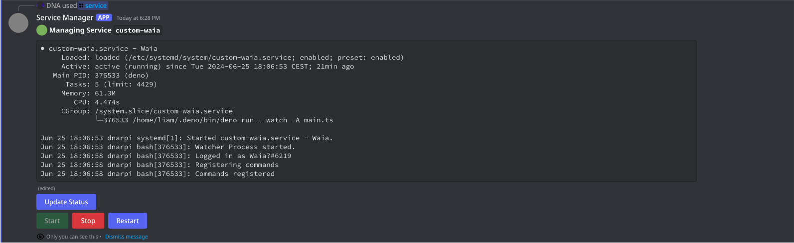
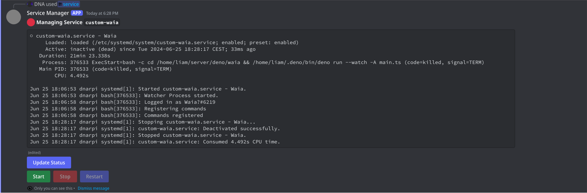

# Discord Service Manager for Linux by DNA

This is a [Deno](https://deno.com) script, which allows you to manage the services on your Linux machine with ease

⚠️ **Note:** This script is required to be run as root, as it uses `systemctl` to manage the services

## Screenshots





## Setup

1. Clone the repository
2. Install [Deno](https://deno.com/)
3. Rename `env.template` to `.env` and fill in the required fields
4. Run `deno run -A main.ts`

## Add as a service

1. Create a new file in `/etc/systemd/system/` called however you want, for example `custom-service-manager.service`
2. Add the following content to the file:

```ini
[Unit]
Description=Discord Service Manager
After=network.target

[Service]
User=root
Group=root
ExecStart=bash -c 'cd /home/liam/server/deno/discord-service-manager && /home/liam/.deno/bin/deno run --watch -A main.ts'

[Install]
WantedBy=multi-user.target
```

> Watch out to replace the paths with your own paths!

3. Run `systemctl enable custom-service-manager` (watch out to change the service name) to enable the service (autostart on boot)
4. Run `systemctl start custom-service-manager` to start the service